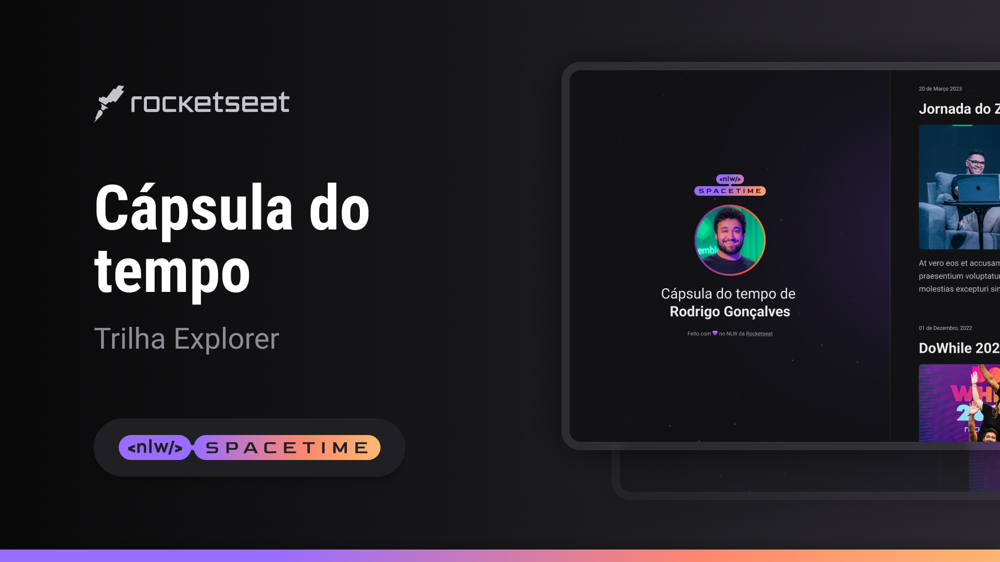

## Projeto

É um projeto Web responsivo que apresenta um sisema de rolagem que apresenta informaçõe sobre o gosto do autor

## Tecnologias

Projeto deenvolvido utilizando:
-HTML
-CSS
-GIT e GITHUB

## Layout

Você pode vizualizar o layoout do projeto através
[desse link](<https://www.figma.com/file/S5q0FGZrkLH3iXWyScnhRp/Cápsula-do-tempo-•-Trilha-Explorer-(Community)?type=design&node-id=306-84&t=LDkVaRK0fe83oej5-0>).
